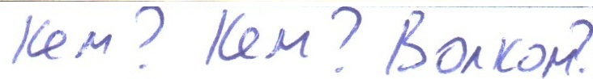
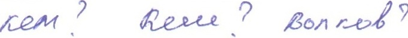
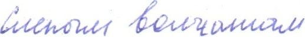
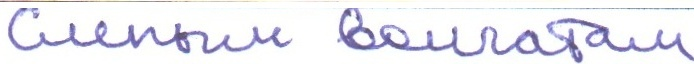
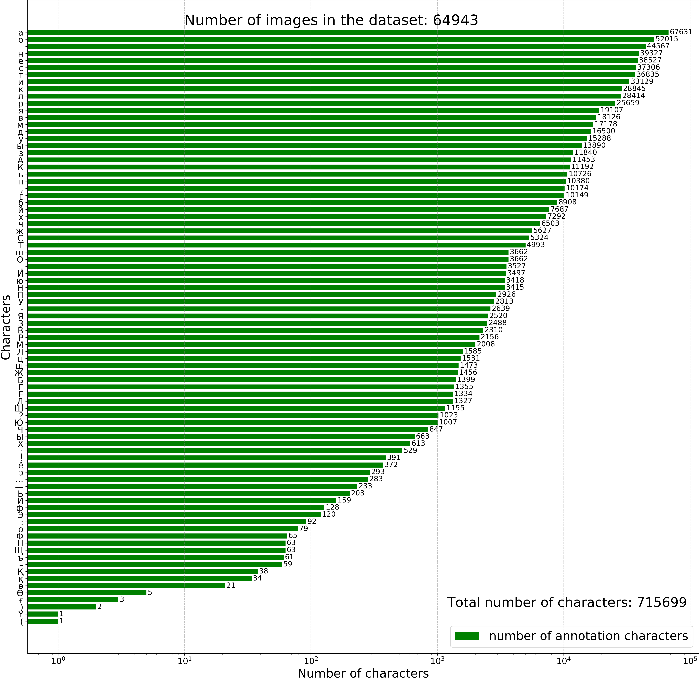

# Handwritten Kazakh and Russian (HKR) database for text recognition

The HKR Dataset for Russian and Kazakh database (with about 95% of Russian and 5% of
Kazakh words/sentences respectively) for offline handwriting recognition.
The dataset can be downloaded through the following link:

- [Cloud](https://cloud.mail.ru/public/25xw/2YPdtaFAF)  

Note: The HKR Dataset can only be used for non-commercial research purpose. 
For researchers who wants to use the HKR database, please first fill
in this [Application Form](Application_Form/Application_Form_for_HKR.doc) 
and send it via email to us ([nurseitovdb@gmail.com](mailto:nurseitovdb@gmail.com),[Kairat.boss@gmail.com](mailto:Kairat.boss@gmail.com)). 

## Description
The database is written in Cyrillic and shares the same 33 characters. Besides these characters, the Kazakh alphabet also contains 9 additional
specific characters. This dataset is a collection of forms. The sources of all the forms in the datasets were generated by LATEX which subsequently was filled out by
persons with their handwriting. The database consists of more than 1400 filled forms. There are approximately 63000 sentences, more than 715699 symbols produced by approximately 200 diferent writers.
We utilized three different datasets described as following:
* Handwritten samples (Forms) of keywords in Kazakh and Russian (Areas, Cities , Village , etc.)
* Handwritten Kazakh and Russian alphabet in cyrillic
* Handwritten samples (Forms) of poems in Russian

The following are some sample of forms from HKR dataset:


The following are some word images after segmented the forms:







For example, the following image shows the number of character in the HKR dataset.




## Split Dataset

Divides the handwriting text dataset into Training, Validation, Test 1, and Test 2 folders. Test1 is a subset of unseen words, Test2 is a subset of words seen, but by other writers.
you can use the following python code to split as we discussed before
https://github.com/bosskairat/Dataset

## Citation and Contact
Please consider to cite our papers when you use our dataset:
```
@article{nurseitov2021handwritten,
  title={Handwritten Kazakh and Russian (HKR) database for text recognition},
  author={Nurseitov, Daniyar and Bostanbekov, Kairat and Kurmankhojayev, Daniyar and Alimova, Anel and Abdallah, Abdelrahman and Tolegenov, Rassul},
  journal={Multimedia Tools and Applications},
  pages={1--23},
  year={2021},
  publisher={Springer}
}
```
```
@article{Abdallah_2020, 
  title={Attention-Based Fully Gated CNN-BGRU for Russian Handwritten Text}, 
  volume={6}, 
  ISSN={2313-433X}, 
  url={http://dx.doi.org/10.3390/jimaging6120141}, 
  DOI={10.3390/jimaging6120141},
  number={12}, 
  journal={Journal of Imaging}, 
  publisher={MDPI AG}, 
  author={Abdallah, Abdelrahman and Hamada, Mohamed and Nurseitov, Daniyar},
  year={2020}, 
  month={Dec},
  pages={141}
}
```
```
@article{DaniyarNurseitov2020,
  author = {{Daniyar Nurseitov, Kairat Bostanbekov, Maksat Kanatov, Anel Alimova, Abdelrahman Abdallah}, Galymzhan Abdimanap},
  doi = {10.25046/aj0505114},
  file = {:D$\backslash$:/ASTESJ/ASTESJ{\_}0505114.pdf:pdf},
  journal = {Advances in Science, Technology and Engineering Systems Journal},
  keywords = {CNN,CTC,Convolutional neural networks,RNN,Recurrent neural networks},
  number = {5},
  pages = {934--943},
  title = {{Classification of Handwritten Names of Cities and Handwritten Text Recognition using Various Deep Learning Models}},
  volume = {5},
  year = {2020}
}
```

For any quetions about the dataset please contact the authors by sending email to Prof. Daniyar Nurseitov
([nurseitovdb@gmail.com](mailto:nurseitovdb@gmail.com)), Dr. Kairat Bostanbekov
([Kairat.boss@gmail.com](mailto:Kairat.boss@gmail.com)) 


